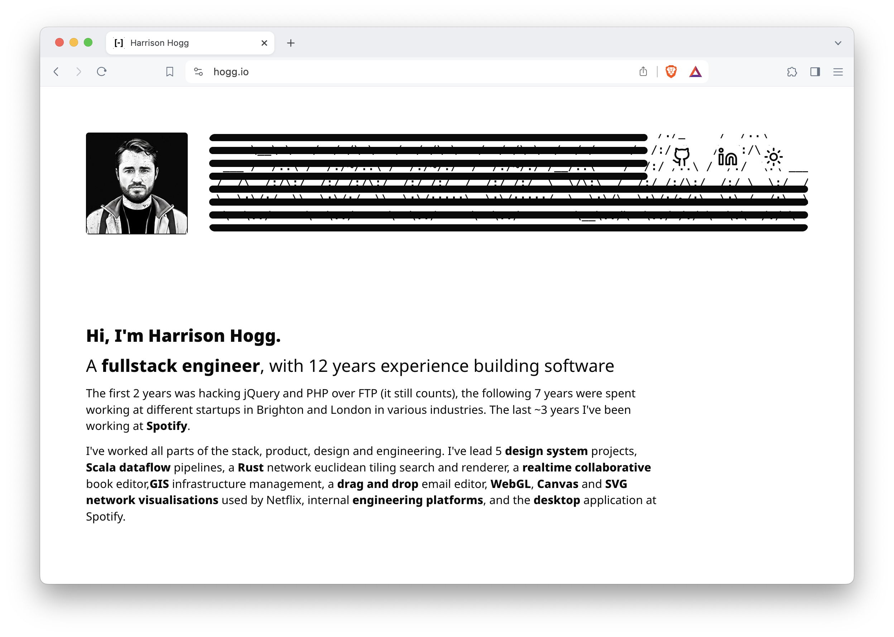

<h2 align="center"  style="margin-bottom: 10px"><a href="https://hogg.io">https://hogg.io</a></h2>

<p align="center"  style="margin-top: 0px">
  My personal website, which I use as a playground for my own learnings and experiments.
</p>

<p align="center"  style="margin-top: 0px">
 
</p>

### Setup

1. [Install Rust (recommended through rustup)](https://rustup.rs/)
1. [Install wasm-pack](https://rustwasm.github.io/wasm-pack/installer/)
1. [Install Node (recommended through NVM)](https://github.com/nvm-sh/nvm)
1. Install Yarn -> `npm i yarn -g`
1. Clone this repo -> `git clone git@github.com:HHogg/hogg.io.git`
1. Enter directory -> `cd hogg.io`
1. Install node dependencies -> `yarn`
1. Install rust dependencies -> `cargo fetch`

#### Optional

1. [Install Postgres](https://www.postgresql.org/) - This is used for the Euclidean tiling search tool. If you don't run it, you wont need Postgres.

### Development

```
yarn dev
```

This will concurrently run a few development processes for watching for main website resources and dependencies. There are a couple of Wasm packages that are built from rust and are also watched and built when the files change.

### Building & deploying

```
yarn build && yarn deploy
```

This will create a SSG build of the website and production builds of the Wasm packages, and will deploy it (Note: This will obviously not deploy to my site if you don't have the auth token).
